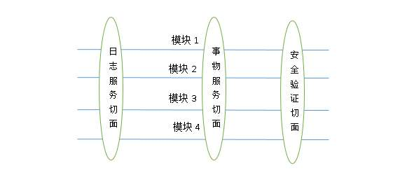
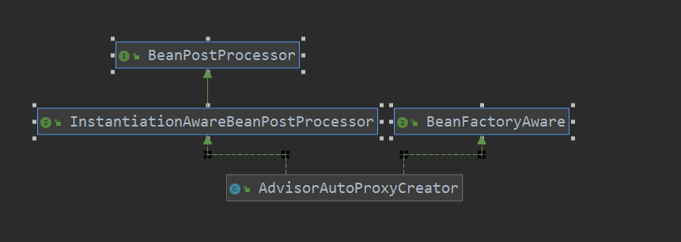
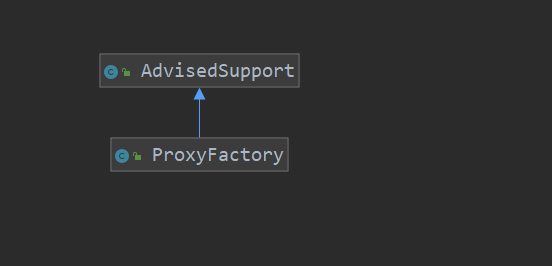
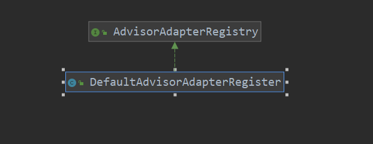
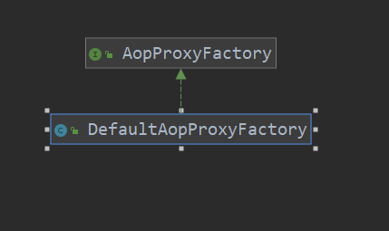
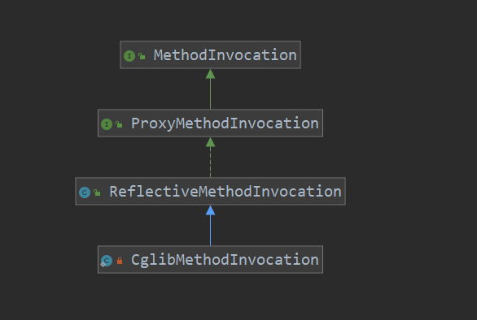

#    SpringAOP

## 实现功能：


**通过在XML文件中配置AdvisorAutoProxyCreator来达到根据Advisor对不同的Bean进行自动配置的功能**

**举例**：**interceptorName是切入的advisor名称，proxyCls是需要进行代理的类名称（**这里按理说都应该设置成list形式，只是IOC中还未支持list标识符，就以单个参数代替了，原理是一样的   ：P）

```
<beans>
    <bean id="boss" class="smallSpring.test.Boss"></bean>
    <bean id="advice" class="smallSpring.aop.advice.Impl.MethodBeforeAdviceImpl"></bean>
    <bean id="advisor" class="smallSpring.aop.advisor.DefaultPointCutAdvisor">
        <property name="advice" ref="advice"></property>
    </bean>

    <bean id="proxyCreator" class="smallSpring.aop.autoproxycreator.AdvisorAutoProxyCreator">
        <property name="interceptorName" value="advisor"></property>
        <property name="proxyCls" value="smallSpring.test.Boss"></property>
    </bean>
</beans>
```

## 原理：

**AOP即面向切面编程，通过CGLIB或者Java动态代理对Bean进行增强来将具体实现的任务分成几个互不相关的层次，举个例子，银行服务器每天都要处理客户的请求工作，像取钱，转账，这是基本任务也就是基础，这个时候如果我们需要去统计银行每种类型的请求的处理次数，如果我们分别对请求代码进行更改会非常麻烦，如果我们通过切面思想就很容易实现这样的需求**


**这里的事物服务切面就是银行的对客户的服务工作，不同的模块代表不同的业务，即取钱转账，日志服务切面就是我们的和计算请求的处理次数类似的工作，总而言之，切面是为了分离核心业务和边角任务之间的方法**

**那对于具体的AOP需要知道一些基本概念，方便我们去理解**

#### Advice通知

**其实翻译成通知还不如翻译成建议更通俗易懂，例如BeforeAdvice就是指在核心业务实现前建议增强的代码，AfterAdvice就是在核心业务实现后建议增强的代码**

```
public interface MethodBeforeAdvice extends MethodAdvice {
  void Before(Method method, Object[] args, Object target) ;

}
```


#### Pointcut切点

**切点的意思其实看名字可能和上面的通知有点混淆，因为advice实际已经通过各种BeforeAdvice，AfterAdvice来实现在方法哪个位置增强了，那为什么还有切点呢，这里的切点我理解就是是否需要对这个具体的业务进行增强，因为其中包含着对过滤和方法匹配器，都是用来做是否增强的判断的**

```
public interface Pointcut {

    ClassFilter getClassFilter();

    MethodMatcher getMethodMatcher();
    Pointcut TRUE = TruePointcut.INSTANCE;

}
```


#### Advisor

**所以现在实现增强的流程就是首先我们得有一个增强的方法Advice，其次我们还要判断是否需要增强即Pointcut，所以就诞生了Advisor，其中的子类PointCutAdvisor将两者结合起来**

```
public interface Advisor {
    Advice getAdvice();

}
```

```
public interface PointCutAdvisor  extends Advisor{
    Pointcut getPointcut();
}

```

**好了，完成上述介绍就可以开始AOP的建设了**

## 


****


## 具体类的说明

**对于AOP里面比较重要的类相对比IOC还是少了不少的**


#### 1.AdvisorAutoProxyCreator（通知自动代理生成器）

**他是我们进入AOP的最外层类，我们最终会通过在XML中对其进行配置来生成我们需要的代理**




#### 2.TargetSource（目标资源）

**CustomClassTargetSource和SingletonTargetSource继承自TargetSource，都是作为对被代理对象的封装**


#### 3.ProxyFactory(代理工厂）

**其实这里才是创建Proxy的核心位置，前面的Creator也是调用这里的ProxyFactory来创建Proxy**



#### 4.AdvisorChainFactory（通知链工厂)和AdvisorAdapterRegistry（通知适配注册器）

**在Creator中我们得到advisor的名字后通过这里转换成我们可以用的Interceptors（拦截器）**





#### 5.AopProxyFactory（aop代理工厂）


**在这里我们根据情况生成具体的AopProxy,Java动态代理形式或者CGLIB形式**




#### 6.AopProxy(Aop代理)

**生成具体的代理对象的类来强化Bean**


#### 7.MethodInvocation（方法调用）

**通过这里代理对象将原方法和增强方法结合在一起被调用**




## 具体流程：

1.Context refresh（）注册BeanProcessor

```
 public void refresh() throws BeansException {
//        增添BeanFactory
        ConfigurableListableBeanFactory beanFactory=obtainFreshBeanFactory();
//         注册beanProcesssors
        registerBeanPostProcessors(beanFactory);
//        结束Factory的构建
        finishBeanFactoryInitialization(beanFactory);
    }
```

#### 2.PostProcessorRegistrationDelegate 注册相关的Bean，也就是我们的Creator因为它继承了PostProcessors

```
public  static void registerBeanPostProcessors(ConfigurableListableBeanFactory beanFactory,
 AbstractApplicationContext applicationContext)
{
    String[]postProcessorNames=beanFactory.getBeanNamesForType(BeanPostProcessor.class);
    {
        for(String name: postProcessorNames)
        {
            Object bean=beanFactory.getBean(name);
            beanFactory.addPostProcessors((BeanPostProcessor) bean);
        }
    }
}
```

**前期准备工作就已经完成了，下面是在创建普通Bean的时候，生成代理对象**


#### 3.在生成Bean的最后阶段，我们根据已经创建好的Bean来生成代理对象，这里就把前面创建的beanProcessor派上用场了


```
public Object initializeBean(Object bean, String beanName) throws BeansException {

//        Object result=bean;
        for (BeanPostProcessor beanProcessor : getBeanPostProcessors()) {
            bean= beanProcessor.postProcessBeforeInitialization(bean, beanName);
        }
        invokeAwareMethods(beanName,bean);
        for (BeanPostProcessor beanProcessor : getBeanPostProcessors()) {
            bean= beanProcessor.postProcessAfterInitialization(bean, beanName);
        }
        return  bean;
    }
```

#### 4.AdvisorAutoProxyCreator开始工作

```
 public Object postProcessBeforeInitialization(Object bean, String beanName) throws BeansException {
        Class<?> beanClass=bean.getClass();
        if ( Advisor.class.isAssignableFrom(beanClass)) {
            return bean;
        }
        if ( MethodInterceptor.class.isAssignableFrom(beanClass)) {
            return bean;
        }
        if(BeanPostProcessor.class.isAssignableFrom(beanClass))
        {
            return  bean;
        }
//        根据指定的代理类生成其代理对象
        try {
            if(beanClass==Class.forName(ProxyCls))
            {
                Object proxy= createProxy(new SingletonTargetSource(bean));
                return proxy;
            }
        } catch (ClassNotFoundException e) {
            e.printStackTrace();
        }

        return bean;
    }
```


#### 5.根据不同情况生成不同的Aop代理

```
@Override
public AopProxy createAopProxy(AdvisedSupport config) {
   if(config.getTargetSource().getTargetClass().isInterface())
   {
       return new JdkDynamicAopProxy(config);
   }
   return new Cglib2AopProxy(config);
}
```


#### 6. 生成代理对象

****

**JdkDynamicAopProxy**

```
public Object getProxy() {
    Class<?>[]Interfaces=advised.getTargetSource().getTargetClass().getInterfaces();
    return Proxy.newProxyInstance(Thread.currentThread().getContextClassLoader(),Interfaces,this);
}
```


**CglibAopProxy**


```
public Object getProxy() {
    Enhancer enhancer = new Enhancer();
    enhancer.setSuperclass(advised.getTargetSource().getTargetClass());
    Class<?>[]Interfaces=advised.getTargetSource().getTargetClass().getInterfaces();
    enhancer.setInterfaces(Interfaces);
    enhancer.setCallback(new DynamicAdvisedInterceptor(advised));
    Object enhanced = enhancer.create();
    return enhanced;
}
```


**这里已经创建出来具体的代理对象了，下面的程序是在对象的方法调用时被执行**


#### **7.方法调用**

#### **JdkDynamicAopProxy**

**执行invoke方法拿到advisedSupport的关于代理的信息**

```
public Object invoke(Object proxy, Method method, Object[] args) throws Throwable {
    TargetSource targetSource=this.advised.getTargetSource();
    Object target=targetSource.getTarget();
    Class<?>targetClass=targetSource.getTargetClass();
    MethodInvocation methodInvocation;
    List<?> chain=this.advised.getIntetceptorsAndDynamicInterceptionAdvice(method,targetClass);
    methodInvocation=new ReflectiveMethodInvocation(args,target,method,proxy,chain);
    return methodInvocation.proceed();
}
```

**ReflectivceMethodInvocation执行调用过程**

```
public Object proceed() throws Throwable {
    if(this.currentInterceptorIndex==this.interceptorsAndMDynamicMethodMatchers.size()-1)
    {
        return  invokeJoinPoint();
    }
    Object advice=this.interceptorsAndMDynamicMethodMatchers.get(++this.currentInterceptorIndex);

    return ((MethodInterceptor)advice).invoke(this);
}
```


#### Cglib2AopProxy


**执行DynamicAdvisedInterceptor的intercept方法（DynamicAdvisedInterceptor是Cglib2AopProxy的内部类）**


```
@Override
public Object intercept(Object proxy, Method method, Object[] args, MethodProxy methodProxy) throws Throwable {
    TargetSource targetSource=advised.getTargetSource();
    Class<?> targetClass=targetSource.getTargetClass();
    Object target=targetSource.getTarget();
    List<?>chain=advised.getIntetceptorsAndDynamicInterceptionAdvice(method,targetClass);
    return new CglibMethodInvocation(args,target,method,proxy,chain,methodProxy).proceed();
}
```


**intercept调用CglibMethodInvocation执行调用过程****


**这里和上面的ReflectivceMethodInvocation是一样的，唯一的不用是在invokeJoinPoint也就是执行原被代理对象的方法时使用Java的反射还是CGLIB自带的方式**

```
public Object proceed() throws Throwable {
    if(this.currentInterceptorIndex==this.interceptorsAndMDynamicMethodMatchers.size()-1)
    {
        return  invokeJoinPoint();
    }
    Object advice=this.interceptorsAndMDynamicMethodMatchers.get(++this.currentInterceptorIndex);

    return ((MethodInterceptor)advice).invoke(this);
}
```